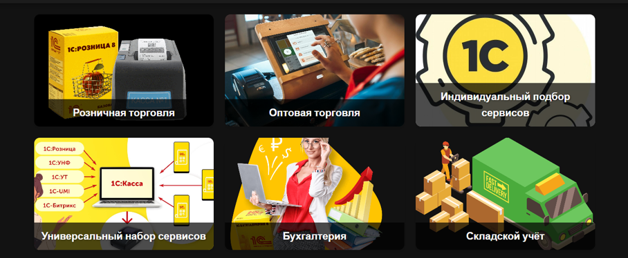
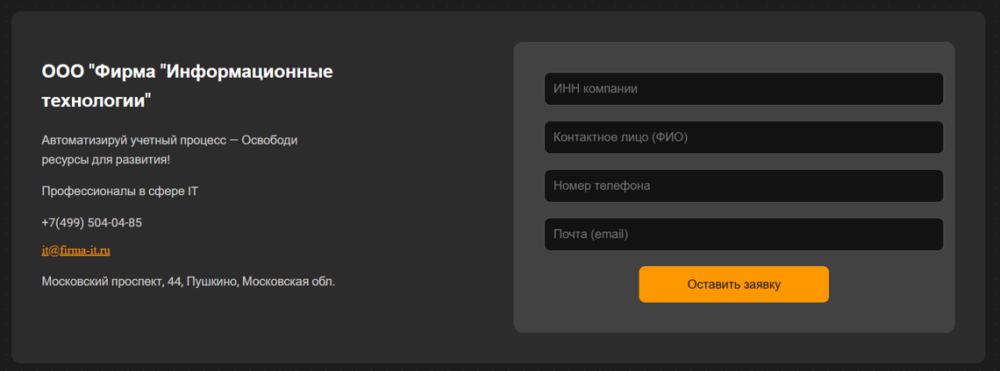

# 🏢 ООО "Информационные технологии" — веб-сайт компании

**Проект:** полностью рабочий веб-сайт для компании «ООО "Информационные технологии"».  
**Цель:** дипломная работа / учебный проект.

Проект реализован на **Flask** с полноценной базой данных, современным интерфейсом и всеми необходимыми функциями для управления товарами, заказами и заявками.

---

## 🚀 Основные функции проекта

- **Работа с базой данных (MySQL)**  
  - Хранение товаров, категорий и заказов
  - Сохранение заявок с сайта и корзины

- **Формы и заявки**  
  - Обработка форм без перезагрузки страницы (AJAX)  
  - Сохранение в БД и отправка на e-mail (Gmail API)

- **Корзина**  
  - Добавление товаров в корзину  
  - Хранение корзины между сессиями  
  - Отправка заявки вместе с корзиной

- **Админ-панель**  
  - Полностью написана вручную  
  - Управление заявками: удаление, редактирование  
  - Защита входа (проверка username/password)

- **Frontend**  
  - HTML (Jinja2), CSS  
  - JavaScript (AJAX, Inputmask)  
  - Адаптивный и современный дизайн

- **API и интеграции**  
  - Яндекс.Карты для отображения точек доставки / контактов  
  - Gmail API для отправки уведомлений

---

## 💻 Технологии и стек

- **Backend:** Python, Flask, pymysql  
- **Database:** MySQL  
- **Frontend:** HTML, CSS, JS (AJAX)  
- **Дополнительно:** Inputmask, Jinja2, API (Yandex Maps, Gmail)  
- **Контейнеризация / деплой:** Docker (опционально)

---

## ⚡ Скриншоты / демо





🎥 [Видео работы сайта](screenshots/demovideo.mp4)


---


## 📦 Как запустить локально

> ⚠️ Для запуска требуется локальная база данных MySQL и настройка подключения в `run.py`.

1. Клонировать репозиторий:
```bash
git clone https://github.com/yourusername/firm_it.git
cd firm_it
```

2. Установить зависимости:
```bash
pip install -r requirements.txt
```

3. Настроить подключение к вашей MySQL базе (создать файл config.py).

4. Запустить приложение:
```bash
python run.py
```

## 🔒 Админ-панель

- Защищена проверкой username/password

- Управление всеми заявками: просмотр, редактирование, удаление

